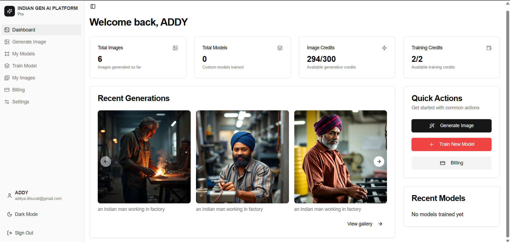
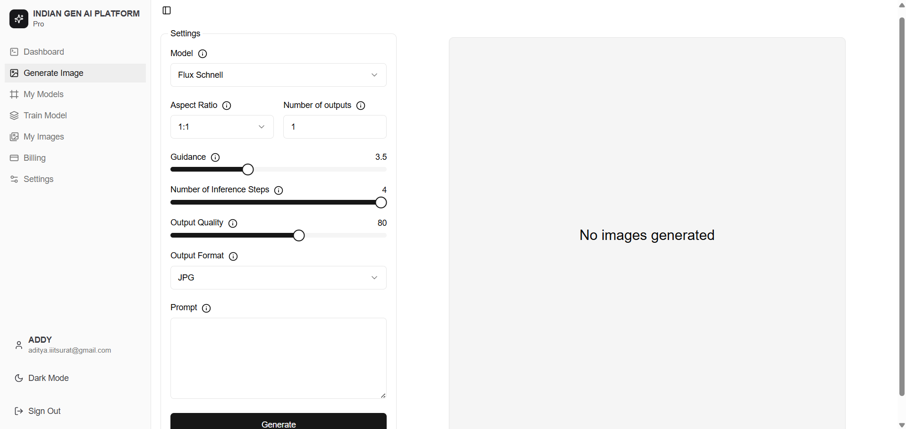
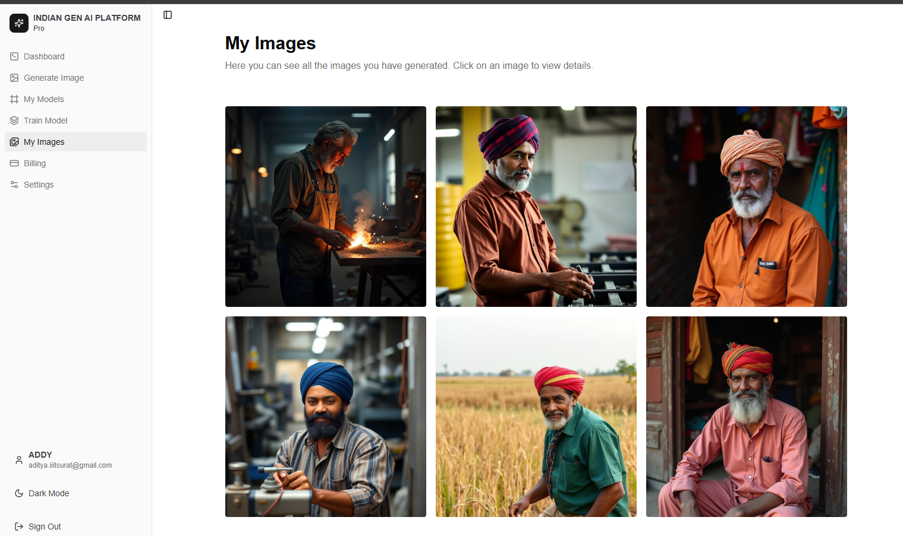
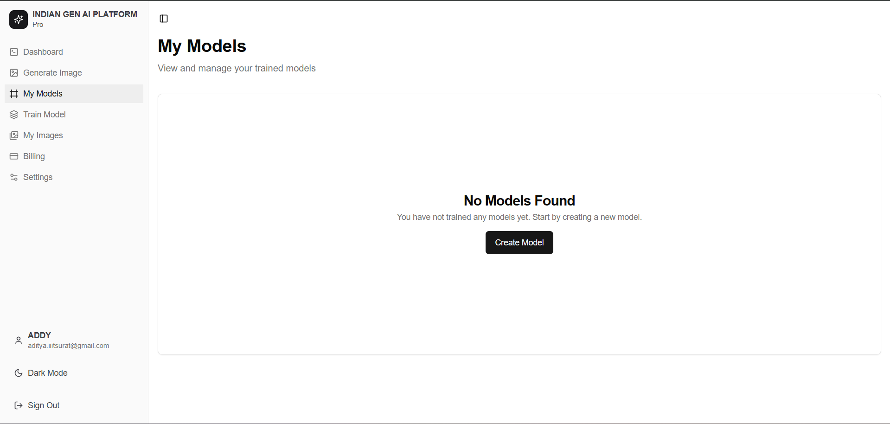
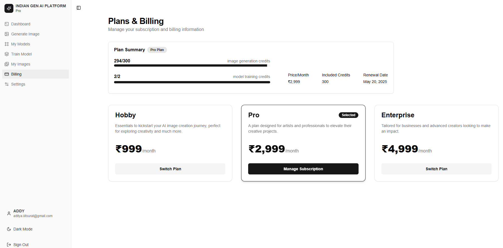
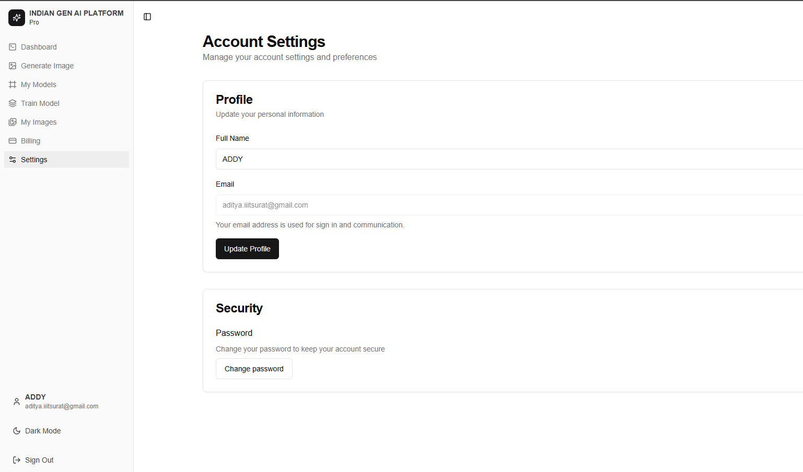

# Indian Gen AI Platform  
## 🎓 Mini Project @ IIIT Surat

### **Project Title:** Personalized AI Photo Generation Platform  
### **Student:** Aditya Kumar (UI22CS03)  and Shruti (UI22CS72)
### **Institute:** Indian Institute of Information Technology, Surat  
### **Course:** B.Tech in Computer Science & Engineering  
### **Project Type:** Mini Project  
### **Semester:** 6th Semester (2025)  
more features we adding
---

## 📘 Project Overview

**Indian Gen AI Platform** is a personalized, AI-powered photo generation platform developed as part of a mini project at **IIIT Surat**. Inspired by platforms like PhotoAI, this SaaS-based solution allows users to upload personal images, train a custom AI model, and generate professional-looking AI photos in various styles, ideal for:

- LinkedIn Headshots  
- Instagram Content  
- Dating Profile Pictures  
- Corporate/Professional Portraits  

With a modern, intuitive UI and full integration of AI services it demonstrates the fusion of frontend engineering, backend logic, and machine learning APIs to build a real-world GenAI application.

---

## 🚀 Key Features  

- 🛠️ Complete SaaS built using Next.js
- 💻 Beautiful landing page included
- 🤖 Train AI model on your personal images
- 🖥️ Clean & intuitive event monitoring dashboard
- 🎯 AI-Powered Professional Photo Generation
- 🎨 Custom AI Model Training
- 💼 Professional LinkedIn Headshots
- 🌟 Modern UI built with shadcn-ui
- 📱 Social Media Content Generation
- 💳 Integrated Payment System (Stripe)
- ✉️ Email Notifications (Resend)
- 📊 Usage Analytics

---

## 🛠️ Tech Stack

- **Framework:** Next.js 15 (App Router)
- **Styling:** Tailwind CSS, Shadcn UI
- **Database:** Supabase (PostgreSQL)
- **Authentication:** Supabase Auth
- **AI Integration:** Replicate AI API
- **Payment Processing:** Stripe
- **Email Service:** Resend
- **Language:** TypeScript

---

## ⚡ Prerequisites

Before you begin, ensure you have:

- Node.js installed (v20.x recommended, v18+ supported) 
- A Supabase account
- A Replicate account
- A Stripe account
- A Resend account

---

## 🚀 Setup Instructions
## 📸 Screenshots

### Dashboard


### Image Generation


### My Image


### My Modal


### Pricing


### Settings


### 1. Clone the Repository

```bash
git clone https://github.com/addygeek/INDIAN-IMAGE-GEN-IIIT-SURAT-MINI-PROJECT.git
cd your-project-directory
```

### 2. Install Dependencies

```bash
npm install
# or
yarn install
# or
pnpm install
```

### 3. Environment Variables

Create a `.env.local` file in the root directory. Check `.env.example` for required variables.

### 4. Supabase Database Setup

1. Create a new Supabase project  
2. Create a storage bucket named `generated_images`  
3. Execute the SQL queries for`supabase` setup
4. Set up database triggers and functions  
5. Configure RLS (Row-Level Security) policies properly  

### 5. AI Model Links

Links to train and use AI models:

- [Flux Dev LORA model trainer](https://replicate.com/ostris/flux-dev-lora-trainer/train)
- [Flux Dev Model](https://replicate.com/black-forest-labs/flux-dev)
- [Flux Schnell Model](https://replicate.com/black-forest-labs/flux-schnell)

*Stock images used from: [Lummi AI](https://www.lummi.ai/)*

### 6. Model Training Requirements

Recommended image guidelines:

- Total: 10–15 images
- Breakdown (for 12 images):
  - 6 face closeups
  - 3–4 half-body shots
  - 2–3 full-body photos
- Vary expressions, outfits, and backgrounds
- No facial accessories (glasses, masks, hats)
- Resolution: 1:1 (1048x1048 or higher)
- Total size under 45MB

### 7. Start Development Server

```bash
npm run dev
# or
yarn dev
# or
pnpm dev
```

Visit `http://localhost:3000` to view the app.

---

## 📦 Project Structure

```
├── app/                 # Next.js 15 app directory
├── components/          # Reusable React components
├── lib/                 # Utility functions & backend logic
├── public/              # Static assets
├── styles/              # Tailwind and global styles
├── .env.example         # Environment variables template
└── README.md            # Project documentation
```

---

## 📸 Screenshots

| Dashboard | Image Generation | My Image | My Modal | Pricing | Settings |
|-----------|-------------------|-------------------|-------------------|-------------------|-------------------|
|  |  |  |   |  |  | 

---

## 📝 License

This project is protected under a **custom restrictive license**. Please read the `LICENSE.md` file carefully before using or modifying this code.  
Key Points:

- ❌ No commercial use allowed  
- ❌ No redistribution or reselling permitted  

---

## 🌟 Show Your Support

If you found this project helpful, feel free to give it a ⭐️ and share with others!

---

> Made with ❤️ at **IIIT Surat**
```

